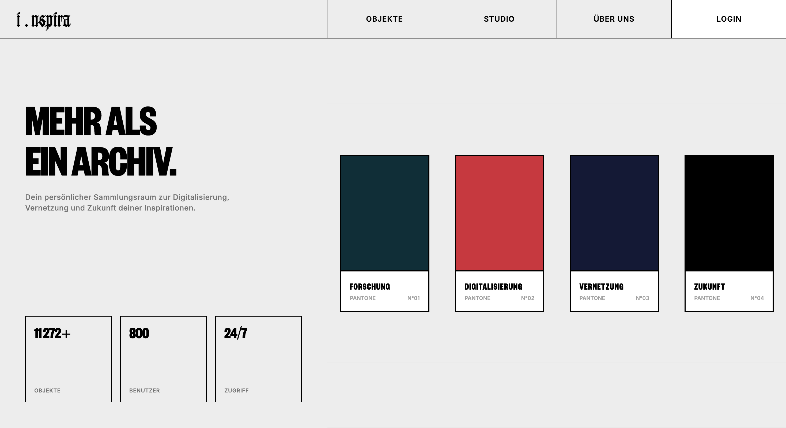
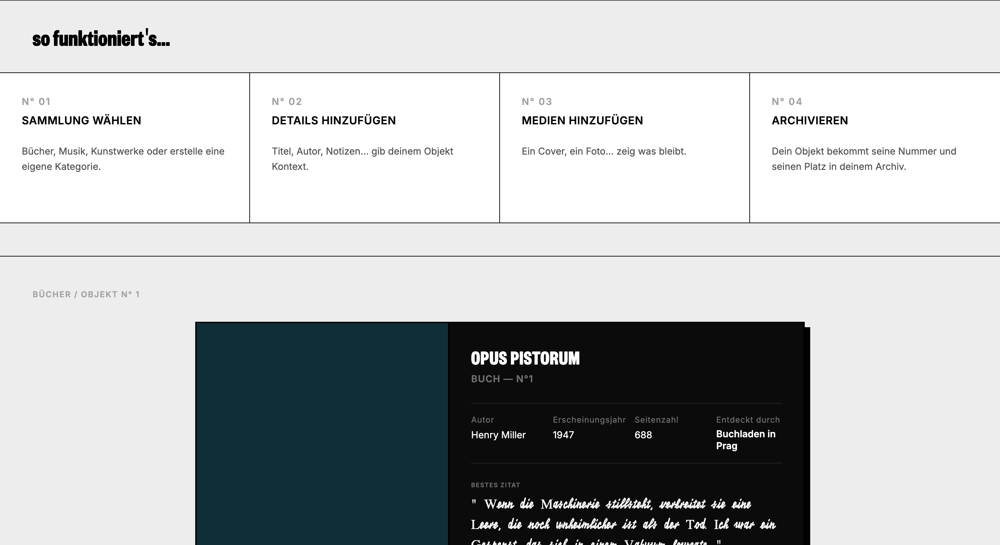
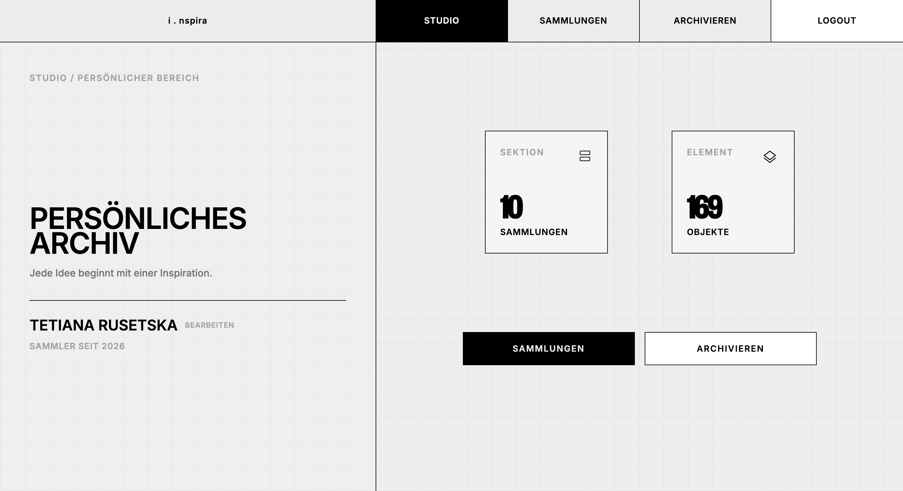
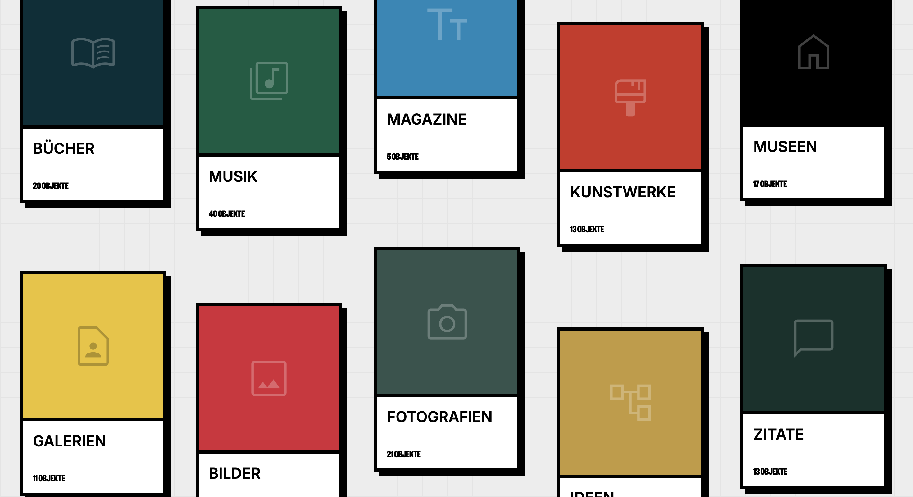
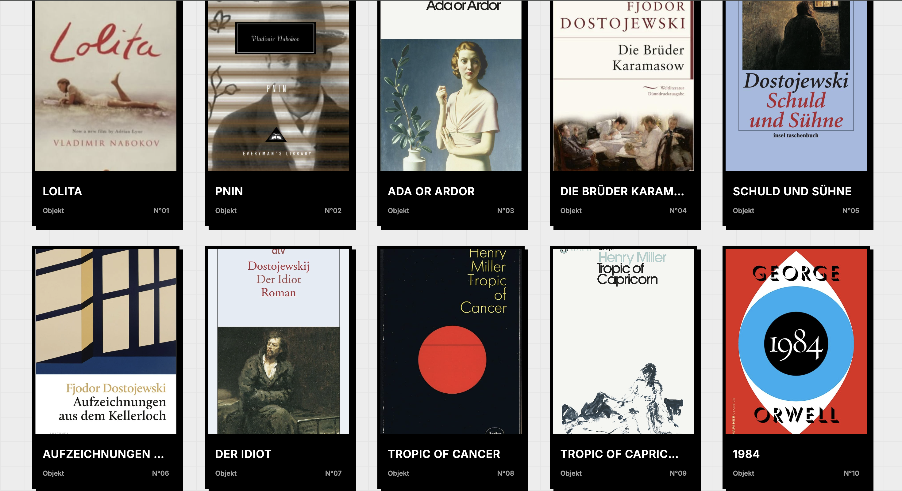
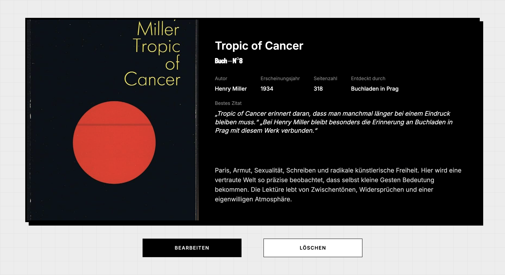
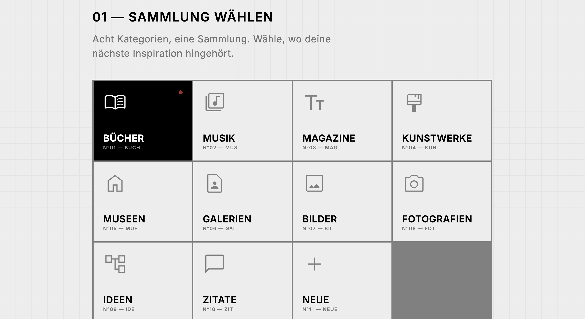
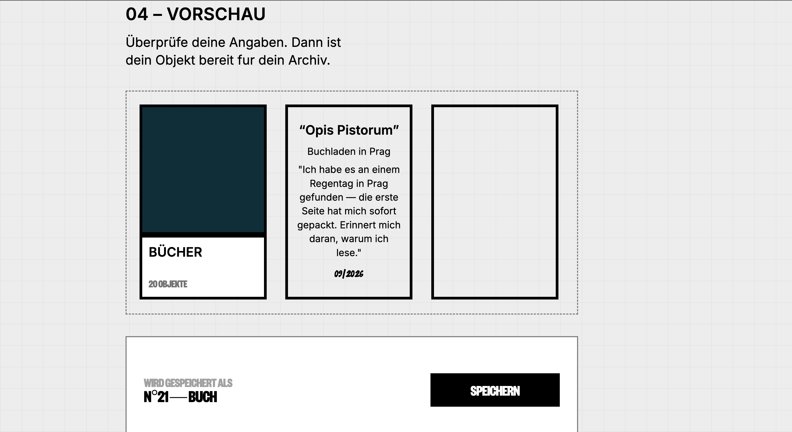

# i . nspira

i.nspira ist ein digitales Archiv für persönliche Sammlungen wie Bücher, Musik, Zeitschriften, Kunstwerke, Museen, Galerien, Fotografien, Ideen und Zitate.
Das Ziel besteht darin, verstreute physische Notizen und Sammlungen durch ein strukturiertes und durchsuchbares digitales Archiv zu ersetzen. 

## Tech-Stack

- **Next.js 16** – React-Framework mit App Router und Server Components
- **TypeScript** – Typsicherheit
- **Prisma 7** – ORM, Typgenerierung und Datenbankmigrationen
- **PostgreSQL** – relationale Datenbank
- **Neon** – Cloud-PostgreSQL-Datenbank für die Produktion
- **Better Auth** – Authentifizierung und Sitzungsverwaltung
- **Docker** – reproduzierbare lokale Entwicklungsumgebung
- **Vercel** – Deployment und Hosting
- **Tailwind CSS** – Styling

## Kernfeatures
- Persönliche Sammlungen für Bücher, Musik, Magazine, Kunstwerke, Museen, Galerien, Fotos, Ideen und Zitate
- Benutzerregistrierung und Authentifizierung
- Private Benutzerdaten
- Neue Einträge erstellen
- Gespeicherte Einträge anzeigen
- Bestehende Einträge bearbeiten
- Einträge löschen
- Strukturierte persönliche Sammlung
- PostgreSQL-Datenbank mit Prisma ORM
- Docker für die lokale Entwicklung
- Deployment mit Vercel und Neon

## Live-Demo
[Vercel-Live-Demo](https://projekt4-next-js-inspira.vercel.app/)

## Screens

